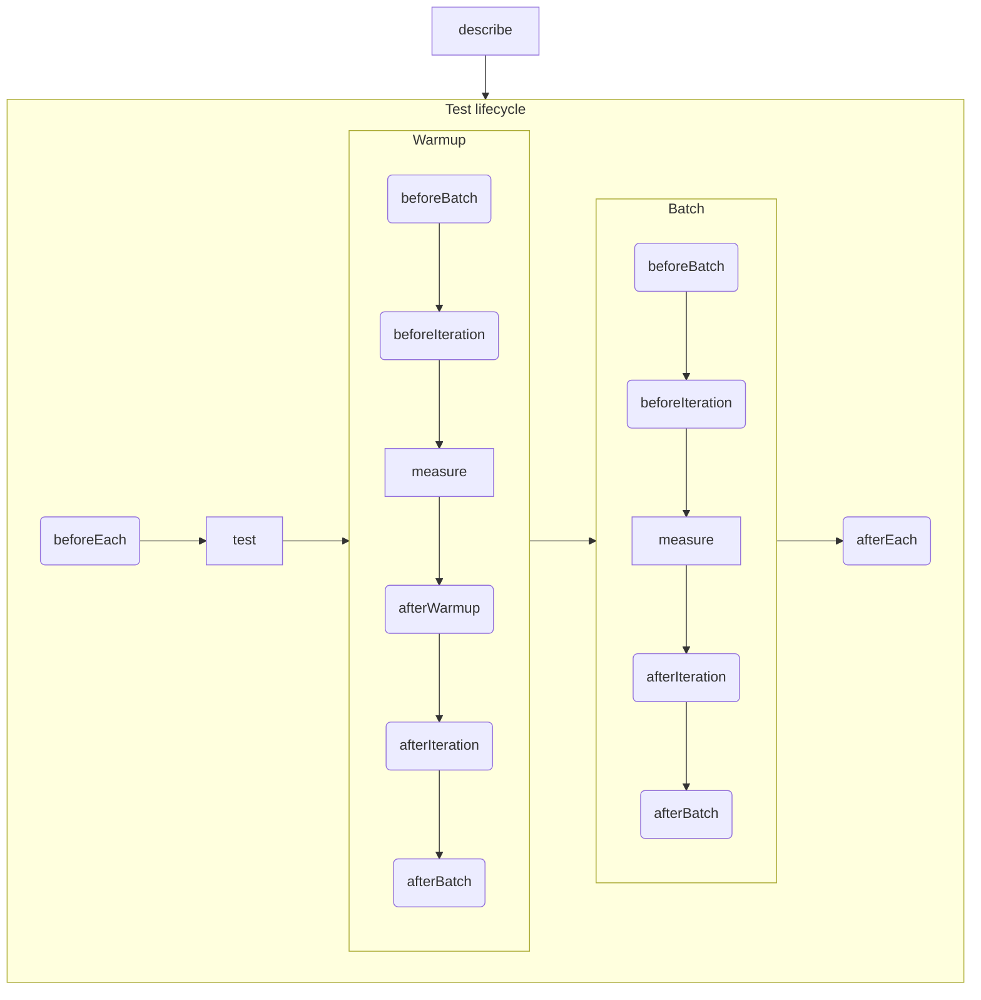

# TooFast ⚡️ [](https://github.com/smikhalevski/toofast/actions/workflows/test.yml)

The Node.js performance testing tool with unit-test-like API.

- Runs each test in a separate process;
- Measures execution time using [`performance`](https://developer.mozilla.org/en-US/docs/Web/API/Performance);
- Runs test functions in multiple batches to reduce garbage collection interference;
- Warms up test functions;
- Measures memory consumption using
  [`process.memoryUsage`](https://nodejs.org/api/process.html#processmemoryusagerss).

```shell
npm install toofast --save-dev
```

- [Usage](#usage)
- [CLI options](#cli-options)
- [Test API](#test-api)
    - [`test`](#test)
    - [`describe`](#describe)
    - [Lifecycle hooks](#lifecycle-hooks)
- [Test options](#test-options)
- [Configuration](#configuration)

# Usage

Let's write a performance test for a function that computes a factorial.

Create a file `factorial.perf.js`:

```ts
function factorial(x) {
  return x === 0 ? 1 : x * factorial(x - 1);
}

describe('factorial', () => {

  test('of 33', measure => {
    measure(() => {
      factorial(33);
    });
  });

  test('of 42', measure => {
    measure(() => {
      factorial(42);
    });
  });
});
```

Call `toofast` in the same directory with this file:

```shell
npx toofast
```

# CLI options

```bash
toofast [options] ...files
```

<dl>
<dt><code>...files</code></dt>
<dd>

The list of glob patterns of included test files. If config file was not found, then files that match `**/*.perf.js` are
included.

</dd>
<dt><code>-c &lt;file&gt;</code>, <code>--config &lt;file&gt;</code></dt>
<dd>

The [configuration](#configuration) file path.

</dd>
<dt><code>-t &lt;pattern&gt;</code>, <code>--testNamePattern &lt;pattern&gt;</code></dt>
<dd>

The name glob pattern of `describe` and `test` blocks that should be run. If specified multiple times then blocks that
match _any_ of the patterns are run.

</dd>
</dl>

# Test API

🔎 [Programmatic API documentation is available here.](https://smikhalevski.github.io/toofast/)

TooFast injects several global callbacks in test files that register lifecycle hooks and trigger test execution.

## `test`

The minimum setup that you need in a test file is the `test` callback which runs a test. For example, let's say there's
a function `factorial()` which performance must be measured. Your whole test could be:

```ts
test('factorial of 33', measure => {
  measure(() => {
    factorial(33);
  });
});
```

The `measure` callback starts the performance measurement. It can be invoked multiple times inside a `test` block to
collect a data population from which an average results are derived.

```ts
test('factorial of 33 and 42', measure => {

  measure(() => {
    factorial(33);
  });

  measure(() => {
    factorial(42);
  });
});
```

The `measure` callback returns a promise that is resolved as soon as performance measurement is completed.

[Test lifecycle](#lifecycle-hooks) is initiated for each `test` block and run in a separate process.

## `describe`

Creates a block that groups together several related tests.

```ts
describe('factorial', () => {

  test('of 42', measure => {
    measure(() => {
      factorial(42);
    });
  });
});
```

`describe` blocks can be nested:

```ts
describe('Math', () => {

  describe('factorial', () => {
    // Tests go here
  });
});
```

## Lifecycle hooks

There are several global functions injected by TooFast that register hooks. Hooks are invoked at different phases of the
performance test suite lifecycle: `beforeEach`, `afterEach`, `afterWarmup`, `beforeBatch`, `afterBatch`,
`beforeIteration`, and `afterIteration`.

The chart below demonstrates when they are called.



Hooks can be registered at root level, or inside a `describe` or `test` block. Registered hooks affect `measure` calls
that are nested in the same enclosing block.

Hooks are always registered before any measurements are started, so the code below would first register `beforeEach` and
`beforeIteration` hooks and only after that would run `measure`.

```ts
describe('factorial', () => {

  beforeEach(() => {
    // Runs before each test
  });

  test('of 42', measure => {
    measure(() => {
      factorial(42);
    });

    beforeIteration(() => {
      // Runs before each measurement iteration
    });
  });
});
```

# Test options

Provide [test options](https://smikhalevski.github.io/toofast/interfaces/TestOptions.html) to [`test`](#test),
[`describe`](#describe) and `measure` functions. Options of nested blocks are merged.

```ts
describe('factorial', { batchTimeout: 500 }, () => {

  test('of 42', { targetRme: 0.2 }, measure => {

    measure({ warmupIterationCount: 5 }, () => {
      factorial(42);
    });
  });
});
```

<dl>
<dt><code>measureTimeout</code></dt>
<dd>

The maximum measure duration in milliseconds. Doesn't include the duration of warmup iterations. Defaults to 10_000.

</dd>
<dt><code>targetRme</code></dt>
<dd>

The maximum relative margin of error that must be reached for each measurement [0, 1]. Defaults to 0.01.

</dd>
<dt><code>warmupIterationCount</code></dt>
<dd>

The maximum number of warmup iterations that are run before each measurement. Defaults to 1. Set to 0 to disable warmup.

</dd>
<dt><code>batchIterationCount</code></dt>
<dd>

The maximum number of iterations in a batch. Unlimited by default.

</dd>
<dt><code>batchTimeout</code></dt>
<dd>

The maximum duration of batched measurements in milliseconds. Defaults to 1_000.

</dd>
<dt><code>batchIntermissionTimeout</code></dt>
<dd>

The delay between batched measurements in milliseconds. VM is expected to run garbage collector during this delay.
Defaults to 200.

</dd>
</dl>

You can also [register hooks](https://smikhalevski.github.io/toofast/interfaces/MeasureOptions.html) specific for a
particular `measure` call.

```ts
test('factorial', measure => {
  measure(
    {
      beforeBatch() {
        gc();
      }
    },
    () => {
      factorial(42);
    }
  );
});
```

# Configuration

By default, TooFast searches for `.toofastrc`, `toofast.json`, or `toofast.config.js` in the current directory.

Configuration file should export the object that satisfies the
[`Config`](https://smikhalevski.github.io/toofast/interfaces/Config.html) interface:

<dl>
<dt><code>testOptions</code></dt>
<dd>

The default [test options](#test-options) used for all tests.

</dd>
<dt><code>include</code></dt>
<dd>

The array of glob patterns of included test files. File paths are resolved relative to the config file.

</dd>
<dt><code>setupFiles</code></dt>
<dd>

The array of glob patters of files that are evaluated in the test environment before any test suites are run. File paths
are resolved relative to the config file.

</dd>
</dl>
