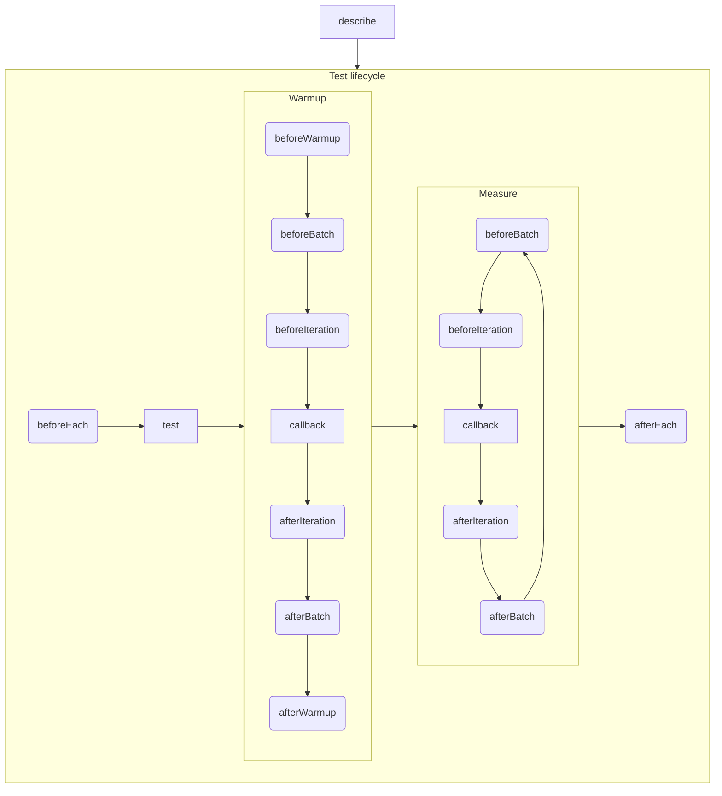

<p align="center">
  <a href="#readme"><picture>
    <source media="(prefers-color-scheme: dark)" srcset="./assets/logo-dark.png" />
    <source media="(prefers-color-scheme: light)" srcset="./assets/logo-light.png" />
    
  </picture></a>
</p>

The Node.js performance testing tool with unit-test-like API.

- Runs each test in a separate process;
- Measures execution time using [`performance`](https://developer.mozilla.org/en-US/docs/Web/API/Performance);
- Runs tested functions in multiple batches to reduce garbage collection interference;
- Warms up tested functions;
- Measures memory consumption using
  [`process.memoryUsage`](https://nodejs.org/api/process.html#processmemoryusagerss).

```shell
npm install toofast --save-dev
```

🔰&ensp;[**Usage**](#usage)

🚀&ensp;[**Authoring tests**](#authoring-tests)
- [`test`](#test)
- [`describe`](#describe)
- [Lifecycle hooks](#lifecycle-hooks)
- [TypeScript support](#typescript-support)

⚙️&ensp;[**Configuration**](#configuration)
- [Test options](#test-options)
- [Command line arguments](#command-line-arguments)
- [Inline options](#inline-options)

# Usage

Let's write a performance test for a function that computes a factorial.

Create a file `factorial.perf.js`:

```ts
import { describe, test, measure } from 'toofast';

function factorial(x) {
  return x === 0 ? 1 : x * factorial(x - 1);
}

describe('factorial', () => {

  test('of 33', () => {
    measure(() => {
      factorial(33);
    });
  });

  test('of 42', () => {
    measure(() => {
      factorial(42);
    });
  });
});
```

Call `toofast` in the same directory with this file:

```shell
npx toofast
```

# Authoring tests

TooFast package exports several callbacks that you can use in test file.

## `test`

The minimum setup that you need in a test file is the `test` callback which encloses a group of measurements.
For example, let's say there's a function `factorial` which performance must be measured. Your whole test could be:

```ts
import { test, measure } from 'toofast';

test('factorial of 33', () => {
  measure(() => {
    factorial(33);
  });
});
```

The `measure` callback starts the performance measurement. It can be invoked multiple times inside a `test` block to
collect a data population from which an average results are derived.

```ts
test('factorial of 33 and 42', measure => {

  measure(() => {
    factorial(33);
  });

  measure(() => {
    factorial(42);
  });
});
```

The `measure` callback returns a promise that is resolved as soon as performance measurement is completed.

## `describe`

Creates a block that groups together several related tests.

```ts
import { describe, test, measure } from 'toofast';

describe('factorial', () => {

  test('of 42', measure => {
    measure(() => {
      factorial(42);
    });
  });
});
```

`describe` blocks can be nested:

```ts
describe('Math', () => {

  describe('factorial', () => {
    // Tests go here
  });
});
```
## Lifecycle hooks

Hooks are invoked at different phases of the performance test suite lifecycle: `beforeEach`, `afterEach`, `afterWarmup`,
`beforeBatch`, `afterBatch`, `beforeIteration`, and `afterIteration`.

The chart below demonstrates when they are called.



Hooks can be registered at root level, or inside a `describe` or `test` block. Registered hooks affect all `measure`
calls that are nested in a block.

Hooks are always registered before any measurements are started, so the code below would first register `beforeEach` and
`beforeIteration` hooks and only after that would run `measure`.

```ts
import { beforeEach, beforeIteration, describe, test, measure } from 'toofast';

describe('factorial', () => {

  beforeEach(() => {
    // Runs before each test
  });

  test('of 42', () => {
    measure(() => {
      factorial(42);
    });

    beforeIteration(() => {
      // Runs before each measure() iteration
    });
  });
});
```

## TypeScript support

TooFast can automatically strip TypeScript types without any additional configuration if `*.{ts,mts}` files are
included:

```shell
toofast --include '**/*.perf.ts'
```

This feature requires Node.js 22.6+.

# Configuration

By default, TooFast searches for `.toofastrc`, `toofast.json`, or `toofast.config.js` in the current working directory.

```json
{
  "testOptions": {
    "measureTimeout": 5000
  },
  "include": [
    "**/*.perf.js"
  ]
}
```

<dl>
<dt><a name="config-testoptions"></a><code>testOptions</code></dt>
<dd>

The default [test options](#test-options) used for all tests.

</dd>
<dt><a name="config-include"></a><code>include</code></dt>
<dd>

The array of glob patterns of included test files. File paths are resolved relative to the config file. Defaults to
`**/*.perf.{js,mjs,ts,mts}`.

</dd>
<dt><a name="config-setup"></a><code>setup</code></dt>
<dd>

The array of glob patters of files that are evaluated in the test environment before any test suites are run. File paths
are resolved relative to the config file.

</dd>
</dl>

## Test options

<dl>
<dt><a name="config-measuretimeout"></a><code>measureTimeout</code></dt>
<dd>

The maximum measure duration in milliseconds. Doesn't include the duration of warmup iterations. Defaults to 10_000.

</dd>
<dt><a name="config-targetrme"></a><code>targetRme</code></dt>
<dd>

The maximum relative margin of error that must be reached for each measurement [0, 1]. Defaults to 0.05.

</dd>
<dt><a name="config-warmupiterationcount"></a><code>warmupIterationCount</code></dt>
<dd>

The maximum number of warmup iterations that are run before each measurement. Defaults to 1. Set to 0 to disable warmup.

</dd>
<dt><a name="config-batchiterationcount"></a><code>batchIterationCount</code></dt>
<dd>

The maximum number of iterations in a batch. Unlimited by default.

</dd>
<dt><a name="config-batchtimeout"></a><code>batchTimeout</code></dt>
<dd>

The maximum duration of batched measurements in milliseconds. Defaults to 1_000.

</dd>
<dt><a name="config-batchintermissiontimeout"></a><code>batchIntermissionTimeout</code></dt>
<dd>

The delay between batched measurements in milliseconds. VM is expected to run garbage collector during this delay.
Defaults to 200.

</dd>
</dl>

## Command line arguments

<dl>
<dt><code>--config</code></dt>
<dd>

The path to a configuration file.

```shell
toofast --config toofast.cfg
```

</dd>
<dt><code>--include</code></dt>
<dd>

The array of glob patterns of included test files.

File paths are resolved relative to the current working directory. Provide this option multiple times to include
multiple patterns. `include` option is specified in a config file is overridden by `--include` arguments.

```shell
toofast --include '**/*.perf.js' --include './perf/**/*.mjs'
```

</dd>
<dt><code>--setup</code></dt>
<dd>

The array of glob patters of files that are evaluated in the test environment before any test suites are run.

File paths are resolved relative to the current working directory. Provide this option multiple times to include
multiple patterns. `setup` option is specified in a config file is overridden by `--setup` arguments.

```shell
toofast --setup setup.perf.js
```

</dd>
<dt><code>--measureTimeout</code></dt>
<dd>

The maximum measure duration in milliseconds.
Overrides [`measureTimeout`](#config-measuretimeout) test option.

</dd>
<dt><code>--targetRme</code></dt>
<dd>

The maximum relative margin of error that must be reached for each measurement [0, 1].
Overrides [`targetRme`](#config-targetrme) test option.

```shell
toofast --targetRme 0.01
```

</dd>
<dt><code>--warmupIterationCount</code></dt>
<dd>

The maximum number of warmup iterations that are run before each measurement.
Overrides [`warmupIterationCount`](#config-warmupiterationcount) test option.

</dd>
<dt><code>--batchIterationCount</code></dt>
<dd>

The maximum number of iterations in a batch.
Overrides [`batchIterationCount`](#config-batchiterationcount) test option.

</dd>
<dt><code>--batchTimeout</code></dt>
<dd>

The maximum duration of batched measurements in milliseconds.
Overrides [`batchTimeout`](#config-batchtimeout) test option.

</dd>
<dt><code>--batchIntermissionTimeout</code></dt>
<dd>

The delay between batched measurements in milliseconds.
Overrides [`batchIntermissionTimeout`](#config-batchintermissiontimeout) test option.

</dd>
<dt><code>...testPatterns</code></dt>
<dd>

The array of glob patterns to filter tests that must be executed across all [included](#config-include) files.

```shell
toofast 'factorial*'
```

</dd>
</dl>

## Inline options

Provide option overrides to a particular [`describe`](#describe), [`test`](#test) and [`measure`](#test) blocks.
Options provided to a block override both config options and command line arguments. Block-level options are propagate
to all underlying blocks as well.

```ts
import { describe, test, measure } from 'toofast';

describe('factorial', () => {

  test('of 33', { warmupIterationCount: 1000 }, () => {
    measure(() => {
      factorial(33);
    });
  });
});
```
